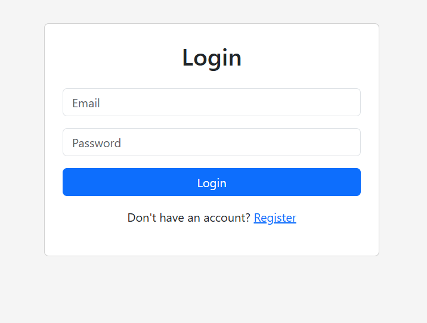
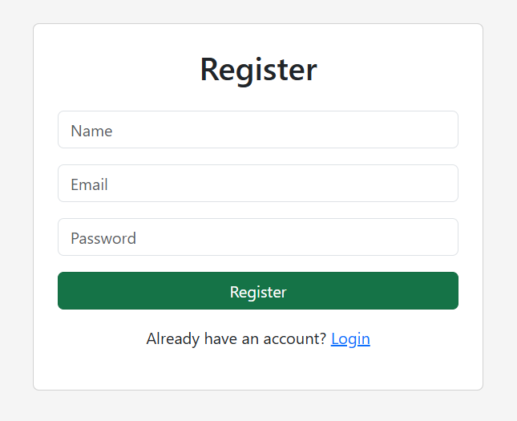
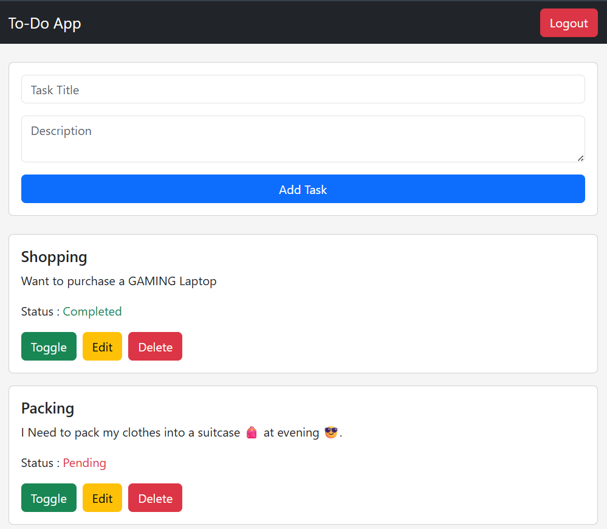

# Full Stack To-Do Application

A simple Full Stack To-Do Application built using the **MERN Stack**. Users can register, log in securely using JWT authentication, and perform CRUD operations on their tasks.

---

## Features

- User Registration
- User Login with JWT Authentication
- Protected Routes
- Create New Tasks
- View All Tasks
- Update Existing Tasks
- Delete Tasks
- Mark Tasks as Completed
- Responsive UI using Bootstrap

---

## Tech Stack

### Frontend
- React (Vite)
- React Router DOM
- Axios
- Bootstrap

### Backend
- Node.js
- Express.js
- MongoDB
- Mongoose
- JWT Authentication
- bcrypt.js

---

## Project Structure

```
FullStack-ToDo/
│
├── todo-api/          # Express Backend
└── todo-frontend/     # React Frontend
```

---

## Installation

### Clone the repository

```bash
git clone <repository-url>
```

### Backend

```bash
cd todo-api
npm install
npm run dev
```

### Frontend

```bash
cd todo-frontend
npm install
npm run dev
```

---

## Environment Variables

Create a `.env` file inside the backend folder.

```env
PORT=5000
MONGO_URI=your_mongodb_connection_string
JWT_SECRET=your_secret_key
```

---

## API Endpoints

### Authentication

| Method | Endpoint |
|--------|----------|
| POST | /api/auth/register |
| POST | /api/auth/login |

### Tasks

| Method | Endpoint |
|--------|----------|
| GET | /api/tasks |
| POST | /api/tasks |
| PUT | /api/tasks/:id |
| DELETE | /api/tasks/:id |

---

## Screenshots

### Login Page



### Register Page



### Home Page



---

## Author

**Ashish Tiwari**
